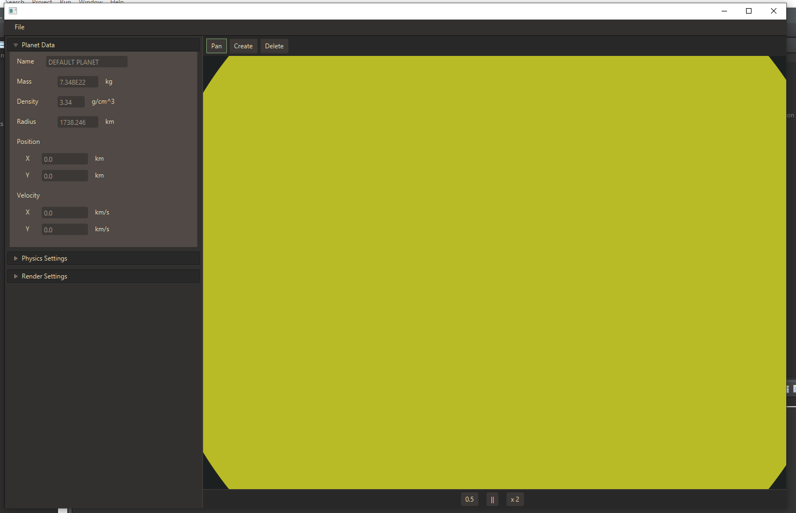

# Planet Simulator

## Synopsis
This tool is designed for high school physics students. The program serves as a sandbox, allowing the user to create Planets of specific mass, density, velocity and at any position in 2D space. The program will then simulate the forces of gravity on these objects in real-time and perfectly to scale. Each of the planet's physical properties (mass, density, position, velocity, radius, etc) are measured using the metric system.

## Motivation
I had a couple of motivations pushing me through this project. I had actually made a similar application years ago in Lua, but the project was full of issues. The formulas used to move objects around were incorrect and nothing was to scale. The code was very janky and didn't take advantage of OOP very well. I wasn't very happy with the final result. I wanted to take the formulas I was using in my physics classes to create unique simulations. That was not possible with my old program.

I also wanted practice with some new Software Architecture principles that I learned earlier this year. I won't go too deep into the specifics, but one of my primary goals of this project was to write code that scales up easily.

## How to Run
If you're just looking to hop right in without looking at the source code, run the executable PlanetGame.jar
Make sure that you have a jdk before running. (I used jdk1.8.0_211)

### Running in Eclipse
* Open Eclipse
* Go to File > Open Projects From File System
* Open this directory
* Go to _src/(default package)/test.java_ in the Project Explorer
* Right Click > Run As > Java Application



If you run the program from Eclipse and the UI doesn't match the screenshot above, please do the following to bring the custom stylesheet in:
 * Through eclipse, go to the _src/styles_ folder
 * double click gruvbox.css and instruct Eclipse to open the file in an external editor
 * doing this should make Eclipse realize this file exists. Try running the program again.

### Using the Simulator
 Once you have the project running, play around with your tools!
 You can use the scroll wheel on your mouse to zoom in and mouse, and left click and drag to pan the camera around. By default, a scale-model simulation of the earth and moon will be in the simulation. You can speed up this simulation using the x2 button at the bottom of your screen.

 If you would like to add a new planet, pause the simulation and equip the Create tool. On the left side of the simulation will be a set of default perameters for the planet you are about to add. Play with those as you will. Once you have those values set to you liking, click anywhere on the simulation to place it. If you needed it at an exact coordinate, you can select the Drag tool, click on the planet, and adjust its position using the property window.

 NOTE
 Large values should be entered in scientific notation. If you wanted, for example, an object of mass 7.2x10^16, just type "7.2E16" into the mass field.


## Code Example
My favorite bit of code in this project was with MouseTools. I wanted to enable the user to interact with the simulation through simple mouse inputs. Below is the abstract class for a MouseTool:

``` Java
// MouseTool.java
package mouseTools;
import javafx.scene.input.*;

public abstract class MouseTool {
	public abstract void onMouseDown(MouseEvent e);

	public abstract void onMouseUp(MouseEvent e);

	public abstract void onMouseMove(MouseEvent e);

	public abstract void onScroll(ScrollEvent e);

	public abstract void onEquip();

	public abstract void onUnequip();

}
  // Dragger.java
  // then in the classes that extend the abstract class, we define each methods behavior. For example :

public void onScroll(ScrollEvent e) {
	double deltaX = e.getDeltaY();
	double zoomFactor = (1.0 + (deltaX / simulationPane.getHeight() * 1));
	Vector mousePosition = new Vector(e.getX(), e.getY());

	zoom(zoomFactor, mousePosition);
}

```
Whenever the user mouses their mouse over the simulation, that user Input is routed to the current MouseTool via `currentTool.onMouseMove()`. When the user changes tools, the old MouseTool receives `onUnequip()` and the new one gets `onEquip()`. Each of the MouseTools do completely different things, but the abstract class unites its similarities and simplifies the interaction. I liked this code a lot because its an excellent usage of polymorphism.

## Tests
I implemented some Unit tests via JUnit4. If you would like to run them or expand on them, they can be found in _src/UnitTests_

If you are using Eclipse, you can right click > Run As > JUnit Test
to run each test in the folder.

Here are some examples of my unitTests from VectorTest.java:

``` Java
// use this method when you need to check if VectorA == VectorB
private void compareVectors(Vector a, Vector b) {
	assertEquals(a.getX(), b.getX());
	assertEquals(a.getY(), b.getY());
}

@Test
void testMagnitude() {
  Vector v = new Vector(3, 4);
  assertEquals(v.magnitude(), 5);

  v = new Vector(-60, 40);
  double expected = Math.sqrt(5200);
  assertEquals(v.magnitude(), expected);
}


```

## Contributors
If you would like to contribute to the project, feel free to fork the project or submit an [issue](https://github.com/DavidJCosby/PlanetSimulator/issues).

Documentation can be found in the [doc](https://github.com/DavidJCosby/PlanetSimulator/tree/master/doc) folder.

This project was made by me (David Cosby), for my Object Oriented course at Southwest Technical College.

Let me know if you have any questions!

David Cosby
davjcosby@gmail.com

5.8.2020
